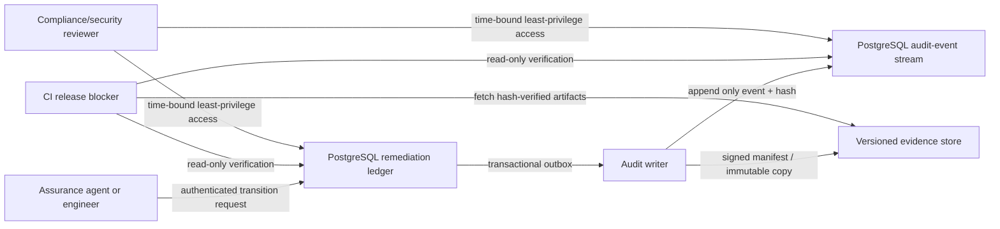

# Enterprise Remediation-Ledger and Audit-Log Storage Guidance

> **Legal/compliance notice:** This is an engineering design and evidence-management guide, not legal advice, a SOC 2 report, or a GDPR compliance determination. A qualified privacy, legal, security, and compliance team must decide applicability, lawful basis, retention, data-subject-rights treatment, control ownership, and evidence sufficiency before relying on it.

## 1. Objective and control boundary

The remediation ledger is the authoritative record that every discovered assurance finding was either fixed with reproducible evidence or remains explicitly release-blocking. The audit log is the independently protected history of who changed the ledger, why, under whose authority, at what source revision, with which evidence, and what release decision followed. Store both in systems that support access control, retention, integrity verification, backup/restore, and retrieval without treating either record as proof of formal compliance by itself.

The AICPA Trust Services Criteria cover the security, availability, processing integrity, confidentiality, and privacy of systems/information in the context of attestation or consulting engagements.[1] The European Commission describes GDPR principles including lawfulness, fairness and transparency, purpose limitation, data minimisation, storage limitation, integrity/confidentiality, and accountability; pseudonymised data that remains re-identifiable is still personal data.[2] These sources are design anchors, not a substitute for an applicability or attestation decision.

| System of record | Required purpose | Must not contain |
|---|---|---|
| Remediation ledger | Finding state, root cause, owner, dependency graph, evidence pointers, verification revision, exception expiry, and release impact. | Source secrets, raw credentials, personal-data payloads, payment instruments, sensitive request/response bodies, or unrestricted log dumps. |
| Audit log | Immutable/tamper-evident record of ledger, evidence, control, approval, and release-decision actions. | Secrets, full tokens, raw identity documents, unminimised payloads, or data unnecessary to establish accountability. |
| Evidence store | Immutable/retrievable artifacts such as signed test reports, scanner output, build provenance, approvals, and restore evidence. | Production datasets or test fixtures containing real personal data unless separately approved and protected. |

## 2. Recommended cloud-agnostic architecture

Use **PostgreSQL** as the transactional control-plane store. Keep the remediation state, authorization metadata, evidence index, and append-only audit-event metadata in a dedicated assurance database/schema. Store large artifacts outside the transactional database in a versioned immutable object store or records repository with retention/hold controls appropriate to the organization. Protect the evidence object with a content hash, immutable object/version identifier, retention/hold metadata, and an access-controlled retrieval path; store only that pointer and hash in PostgreSQL.



Separate duties as follows. The application/agent role may propose a finding transition and attach evidence, but it should not be able to delete audit data, alter retention, or approve its own exception. A distinct reviewer/release role approves privileged transitions. A restricted audit-writer identity writes audit events. A database/records administrator manages backup and restoration but does not approve remediation. Operational access must be reviewed periodically and logged.

## 3. PostgreSQL remediation-ledger schema

The following is an illustrative PostgreSQL model. Apply it as a reviewed migration, restrict DDL privileges, test it in a non-production environment, and adapt classification/retention fields to approved policy.

```sql
CREATE SCHEMA IF NOT EXISTS assurance;
REVOKE ALL ON SCHEMA assurance FROM PUBLIC;

CREATE TYPE assurance.finding_state AS ENUM (
  'DISCOVERED', 'TRIAGED', 'IMPLEMENTING', 'REGRESSION_PROVEN',
  'RETESTING', 'VERIFIED_FIXED', 'EXTERNAL_BLOCKED'
);

CREATE TABLE assurance.runs (
  run_id uuid PRIMARY KEY,
  repository_uri text NOT NULL,
  commit_sha char(40) NOT NULL,
  baseline_report_sha256 char(64) NOT NULL,
  initiated_by_subject_ref text NOT NULL,
  started_at timestamptz NOT NULL DEFAULT clock_timestamp(),
  completed_at timestamptz,
  decision text CHECK (decision IN ('BLOCKED', 'CONDITIONAL', 'RELEASEABLE')),
  report_artifact_uri text NOT NULL,
  report_artifact_sha256 char(64) NOT NULL,
  UNIQUE (repository_uri, commit_sha, baseline_report_sha256)
);

CREATE TABLE assurance.findings (
  finding_id text PRIMARY KEY,
  run_id uuid NOT NULL REFERENCES assurance.runs(run_id),
  detector_id text NOT NULL,
  detector_fingerprint char(64) NOT NULL,
  severity text NOT NULL CHECK (severity IN ('BLOCKER', 'CRITICAL', 'HIGH', 'MEDIUM', 'LOW')),
  current_state assurance.finding_state NOT NULL DEFAULT 'DISCOVERED',
  root_cause_group text,
  owner_subject_ref text NOT NULL,
  source_locator jsonb NOT NULL,
  affected_path_hashes jsonb NOT NULL DEFAULT '[]'::jsonb,
  depends_on text[] NOT NULL DEFAULT '{}',
  verified_commit_sha char(40),
  verification_artifact_uri text,
  verification_artifact_sha256 char(64),
  exception_expires_at timestamptz,
  data_classification text NOT NULL DEFAULT 'INTERNAL',
  created_at timestamptz NOT NULL DEFAULT clock_timestamp(),
  updated_at timestamptz NOT NULL DEFAULT clock_timestamp(),
  CHECK ((current_state <> 'VERIFIED_FIXED') OR
         (verified_commit_sha IS NOT NULL AND verification_artifact_sha256 IS NOT NULL)),
  CHECK ((current_state <> 'EXTERNAL_BLOCKED') OR exception_expires_at IS NOT NULL)
);

CREATE TABLE assurance.finding_transitions (
  transition_id uuid PRIMARY KEY,
  finding_id text NOT NULL REFERENCES assurance.findings(finding_id),
  prior_state assurance.finding_state,
  next_state assurance.finding_state NOT NULL,
  actor_subject_ref text NOT NULL,
  actor_role text NOT NULL,
  rationale text NOT NULL,
  source_commit_sha char(40),
  evidence_uri text,
  evidence_sha256 char(64),
  created_at timestamptz NOT NULL DEFAULT clock_timestamp(),
  CHECK (prior_state IS NULL OR prior_state <> next_state)
);

CREATE TABLE assurance.evidence_artifacts (
  artifact_id uuid PRIMARY KEY,
  finding_id text REFERENCES assurance.findings(finding_id),
  media_type text NOT NULL,
  object_uri text NOT NULL,
  sha256 char(64) NOT NULL,
  created_by_subject_ref text NOT NULL,
  source_commit_sha char(40) NOT NULL,
  data_classification text NOT NULL,
  retention_class text NOT NULL,
  legal_hold boolean NOT NULL DEFAULT false,
  created_at timestamptz NOT NULL DEFAULT clock_timestamp(),
  UNIQUE (object_uri, sha256)
);
```

The transition API should enforce the lifecycle at the database or service layer, not merely in a UI. For example, `VERIFIED_FIXED` requires the exact source commit and hash-addressed evidence; `EXTERNAL_BLOCKED` requires a named external dependency, a minimal unblock request, and an expiration/review date. The CI job should read the ledger with a read-only role and fail if any finding is not `VERIFIED_FIXED`, any evidence hash is unavailable/mismatched, or its verification commit is stale relative to the merge candidate.

## 4. Audit-event design and integration

Every mutation to `assurance.runs`, `assurance.findings`, `assurance.finding_transitions`, `assurance.evidence_artifacts`, release approvals, retention/hold records, or role assignments must emit an audit event in the same transaction through a transactional outbox. A background audit writer delivers an immutable representation to the audit stream and evidence store. This pattern prevents a successful business/ledger transition with a silently missing audit event, while enabling retry/replay after a temporary sink outage.[3]

| Field | Engineering requirement | Privacy/data-minimisation treatment |
|---|---|---|
| `event_id`, `stream_id`, `sequence` | Globally unique event and ordered per-stream sequence. | Non-personal identifiers. |
| `occurred_at_utc`, `recorded_at_utc` | UTC timestamps from controlled application/database clock. | Do not infer activity beyond the stated purpose. |
| `actor_subject_ref` | Stable pseudonymous user/service reference. | Store a one-way or separately protected reference rather than name/email where possible. |
| `actor_role`, `auth_context_ref` | Role and trace/correlation reference for authorization review. | Never write raw bearer tokens, cookies, or credentials. |
| `action`, `resource_type`, `resource_ref` | Controlled vocabulary for state changes/read/export/approval/exception actions. | Avoid raw resource payloads; use identifiers/pseudonymous references. |
| `before_hash`, `after_hash` | Hashes of canonical permitted state representations. | Hash only policy-approved canonical content; a reversible/lookupable identifier may still be personal data. |
| `reason_code`, `change_ticket_ref`, `evidence_ref` | Reason and evidence links for accountability. | Keep free text minimised and redacted; use controlled reason codes. |
| `previous_event_hash`, `event_hash`, `signature_ref` | Tamper-evident chain and optional batch signature/manifest reference. | Contains no personal payload by itself. |

Illustrative event shape:

```json
{
  "event_id": "018f...",
  "stream_id": "finding:ASSURANCE-0001",
  "sequence": 7,
  "occurred_at_utc": "2026-08-13T14:23:56.137Z",
  "actor_subject_ref": "subj_hmac:v1:...",
  "actor_role": "independent_reviewer",
  "action": "finding.transition.approved",
  "resource_type": "remediation_finding",
  "resource_ref": "ASSURANCE-0001",
  "before_hash": "sha256:...",
  "after_hash": "sha256:...",
  "reason_code": "REGRESSION_AND_GATE_VERIFIED",
  "change_ticket_ref": "CHG-1234",
  "evidence_ref": "artifact:uuid",
  "previous_event_hash": "sha256:...",
  "event_hash": "sha256:...",
  "signature_ref": "manifest:2026-08-13T14:00Z"
}
```

Store audit events append-only. Application roles should have no `UPDATE` or `DELETE` privilege on the audit table; direct database superuser access remains a risk that must be covered by administrative controls, monitored access, backups, and an independently retained immutable/signed evidence copy. Hash chaining makes unauthorized alteration detectable; it does not by itself prevent an all-powerful database administrator from rewriting a chain. Periodically sign or otherwise externally attest a batch manifest and preserve it in a separately controlled immutable store.

## 5. GDPR-aware configuration

GDPR applies technology-neutrally to processing, including storage, retrieval, and destruction of personal data, and the Commission identifies data minimisation, storage limitation, integrity/confidentiality, and accountability among the core principles.[2] Configure the ledger/audit program to support—not silently defeat—these obligations.

| Control area | Engineering configuration | Evidence expected |
|---|---|---|
| Data inventory and purpose | Classify every field; document the purpose of assurance evidence and audit accountability. | Data map, record of processing linkage, approved field catalogue. |
| Minimisation | Store controlled identifiers and content hashes; redact/free-text restrict logs; prohibit raw request bodies, credentials, and identity documents. | Schema review, log tests, scanner output, code review. |
| Pseudonymisation | Use a stable protected subject reference; keep re-identification mapping separately access-controlled. | Key/access design, role tests, mapping-access audit events. |
| Retention and deletion | Apply a policy-approved retention class and legal-hold flag to each artifact/event. Define deletion/erasure workflows that preserve only legally necessary accountability data. | Retention schedule, scheduled job/run output, deletion/hold tests, exception approvals. |
| Data-subject rights | Do not blindly delete audit records. Route requests through privacy/legal review to determine lawful retention, minimize disclosed data, and record the decision. | Rights-request workflow, export/redaction test, decision record. |
| Access and transfer | Enforce least privilege, encryption in transit/at rest, environment separation, processor contracts, and approved transfer controls where applicable. | Access reviews, encryption/configuration evidence, vendor/processor review. |

A log containing a pseudonymous or hashed user reference may still be personal data if it can be related back to an individual; treat it accordingly.[2] Retention duration cannot be set generically by this guide: it depends on the processing purpose, contractual/regulatory duties, legal holds, and approved organizational policy.

## 6. SOC 2-oriented evidence configuration

Map engineering controls to the organization’s adopted Trust Services Criteria scope. The table below is an evidence-planning aid only; an independent auditor determines the design/operating-effectiveness conclusions.

| TSC-oriented objective | Ledger/audit implementation | Example evidence |
|---|---|---|
| Security | Least-privilege roles, separated duties, authenticated transition API, protected secrets, audit access reviews. | IAM policies, quarterly access review, negative authorization tests, audit events. |
| Availability | PostgreSQL backup/restore, replication/recovery plan, evidence-store availability objective, monitoring and alerting. | Restore rehearsal, monitoring export, incident/runbook exercise. |
| Processing integrity | Lifecycle transition enforcement, hash-addressed evidence, final merge-candidate gate, idempotency/concurrency checks. | Gate results, transition history, regression results, reconciliation records. |
| Confidentiality | Data classification, minimised schema, encryption, protected evidence objects, restricted retrieval. | Classification review, encryption configuration, data-access audit output. |
| Privacy | Approved purpose/retention/rights workflows and privacy access controls if personal data is in scope. | Applicability decision, retention/deletion test, rights-request procedure. |

## 7. Operational controls and validation cadence

| Cadence | Required activity | Owner separation |
|---|---|---|
| Every assurance run | Generate report, reconcile report findings to ledger, hash/store evidence, emit audit events, block on unresolved/stale records. | Agent/engineer proposes; CI validates. |
| Every pull request/merge candidate | Revalidate affected ledger records and execute the full policy gate on the combined candidate. | Independent CI/release gate. |
| Daily or scheduled | Verify audit stream sequence/hash chain, object availability/hash, failed outbox delivery, and retention job errors. | Security/operations monitoring. |
| Quarterly or policy cadence | Review roles, exceptions, external blocks, evidence retention, restore ability, and audit retrieval. | Security/compliance/reviewer. |
| At least annually or after material change | Exercise incident, backup/restore, data-rights, audit export, and release-evidence retrieval procedures. | Independent control owners. |

## 8. Minimum implementation checklist

| Item | Required before claiming the control is implemented |
|---|---|
| Ledger schema and API | Lifecycle is enforced server-side; `VERIFIED_FIXED`/`EXTERNAL_BLOCKED` require complete evidence fields. |
| Audit integration | Transactional outbox, idempotent audit writer, append-only database access, tamper-evidence validation, and external immutable manifest copy are tested. |
| Evidence storage | Hash verification, retention/hold metadata, least-privilege retrieval, backup/restore, and data classification are implemented and tested. |
| CI integration | Merge-candidate CI rejects unresolved/stale ledger entries, missing/mismatched evidence, non-zero gate findings, and unapproved exceptions. |
| Privacy controls | Field inventory, minimisation, rights/retention workflow, and approved applicability decisions are documented and tested. |
| Compliance governance | Named control owner, independent reviewer, records schedule, exception process, and audit-evidence retrieval procedure exist. |

## References

[1]: https://www.aicpa-cima.com/resources/download/2017-trust-services-criteria-with-revised-points-of-focus-2022 "AICPA: 2017 Trust Services Criteria (revised points of focus 2022)"
[2]: https://commission.europa.eu/law/law-topic/data-protection/data-protection-explained_en "European Commission: Data protection explained"
[3]: https://martinfowler.com/articles/patterns-of-distributed-systems/transactional-outbox.html "Transactional Outbox pattern"
[4]: https://csrc.nist.gov/pubs/sp/800/53/r5/upd1/final "NIST SP 800-53 Rev. 5"
